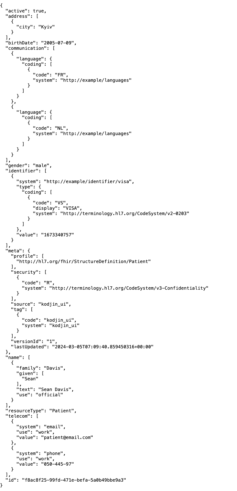
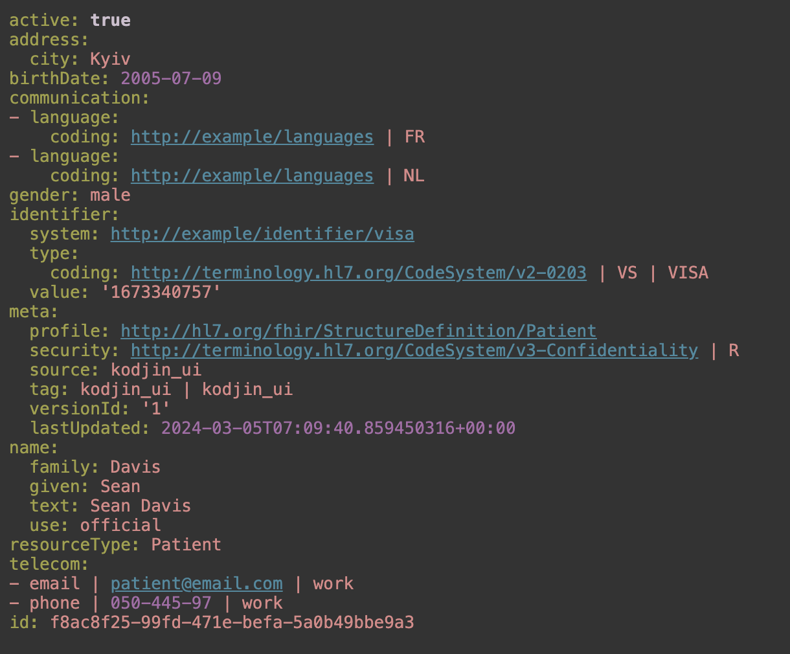

# HUFF / Human-friendly FHIR (no pun intended)

## Build
```bash
./build.sh
```

## Run

Load FHIR from FHIR server via `curl` (expects the server to answer with JSON by default, otherwise specify explicitly). Pass authentication token to `curl` via ENV variable. Pipe `curl` output to `hff` and then to `yh` for syntax highlighting (install `yh` via `apt`, `brew`, ..).
```bash
export AUTH_TOKEN="eyJhbGciOi..."
curl -s --header 'Authorization: Bearer '"$AUTH_TOKEN"'' "https://fhir.com/Practitioner/1234" | hff | yh
```

Run with custom mappings.
```bash
export AUTH_TOKEN="eyJhbGciOi..."
curl -s --header 'Authorization: Bearer '"$AUTH_TOKEN"'' "https://fhir.com/Practitioner/1234" | hff -m "./my/custom/mappings.hfc" | yh
```

## Install chrome extension
Just build and load the `chrome-extension` directory as an unpacked extension. You can modify the mappings (in *.hfc format) in the extension options.

### Chrome extension screenshots

URL: https://demo.kodjin.com/fhir/Patient/f8ac8f25-99fd-471e-befa-5a0b49bbe9a3

JSON presentation of the FHIR resource:


HUFF presentation of the same FHIR resource:


## Customization at build time
You can customize the output by editing the `hff-rs/resources/mapping.hfc` file. The syntax is a simple format. The `hff-rs/resources/mapping.hfc` file is a good starting point. Quickly, the format is:
- Lines starting with `//` are comments
- Lines starting with `#` specify the signature a JSON node needs to match to be processed by the following line. E.g. if the signature is `#[value, unit, system]` think of it as beeing equal to the JSONPath `$.*[?(@.hasOwnProperty('value') && @.hasOwnProperty('unit') && @.hasOwnProperty('system'))]`. The reason why this is not implemented as a JSONPath in the first place is just KIS but this might change in future.
- The line after the signature specifies the reformatting of the JSON node. You can specifiy any string here where the content of the `{..}` placeholder is interpreted as a JSONPath expression relative to the current node. E.g. `{$.family}` will extract the value of the `family` property of the current node. If the JSONPath expression returns an array this is automatically joined via whitespace into a string. 